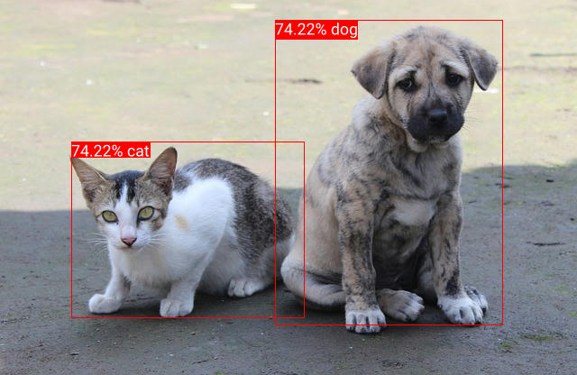

# Mediapipe

## Requirement

The installation process for mediapipe showing below is running on ubuntu22.04. You can launch a docker container for this tutorial:

```bash
docker pull ubuntu:22.04
docker run -it --rm ubuntu:22.04

# install necessary compile tools
apt update
apt install build-essential
```

Download the code repo of demo-object-detection:

```bash
git clone https://github.com/juntao/demo-object-detection.git
```

Install WasmEdge with WASI-NN Tensorflow Lite plugins.

```bash
# install rust and related deps
curl --proto '=https' --tlsv1.2 -sSf https://sh.rustup.rs | sh
rustup target add wasm32-wasi
# install wasmedge with wasi-nn plugin
curl -sSf https://raw.githubusercontent.com/WasmEdge/WasmEdge/master/utils/install.sh | bash -s -- --plugins wasi_nn-tensorflowlite -p /usr/local

# add them to your PATH
source "$HOME/.cargo/env"
source "$HOME/.wasmedge/env"
```

## Prepare WASM application

#### (Recommend) Use the pre-built one bundled in this repo

We built a optimized wasm of this example under the folder, check `wasmedge-tflite-mediapipe-detection-aot.wasm`

#### (Optional) Build from source

```bash
cd demo-object-detection

# Compile the application to WebAssembly:
cargo build --target wasm32-wasi --release
```

The wasm file will be located at `target/wasm32-wasi/release/demo-object-detection.wasm`. You can then copy it to your working dir:

```bash
cp ./target/wasm32-wasi/release/demo-object-detection.wasm ./demo-object-detection.wasm
```

Or you can use WasmEdge AOT mode to further optimize the result wasm:

```
wasmedge compile ./target/wasm32-wasi/release/demo-object-detection.wasm ./demo-object-detection-aot.wasm
```

## Excute

We already offer the model fixture for object detection in the repo: `./src/mobilenetv2_ssd_256_uint8.tflite`, as well as the input image:


You can run this task with one-line:

```bash
wasmedge --dir .:. demo-object-detection.wasm example.jpg output.jpg
```

It will save an image with box annoation around the cat and dog:



And output the detailed coordinates of the boxes in command line:

```
DetectionResult:
  Detection #0:
    Box: (left: 0.47665566, top: 0.05484602, right: 0.87270254, bottom: 0.87143743)
    Category #0:
      Category name: "dog"
      Display name:  None
      Score:         0.7421875
      Index:         18
  Detection #1:
    Box: (left: 0.12402746, top: 0.37931007, right: 0.5297544, bottom: 0.8517805)
    Category #0:
      Category name: "cat"
      Display name:  None
      Score:         0.7421875
      Index:         17
```

You can also run the same task, but with the wasm file compiled by WasmEdge:

```bash
wasmedge --dir .:. demo-object-detection-aot.wasm example.jpg output.jpg
```

It will get the identical results and faster.

## Credit

* The WASI-NN TFLite plugin embedded `tensorflow-lite` as its backend.
* This demo use the pre-trained model from [Medipipe solution](https://developers.google.com/mediapipe/solutions/vision/object_detector#get_started)